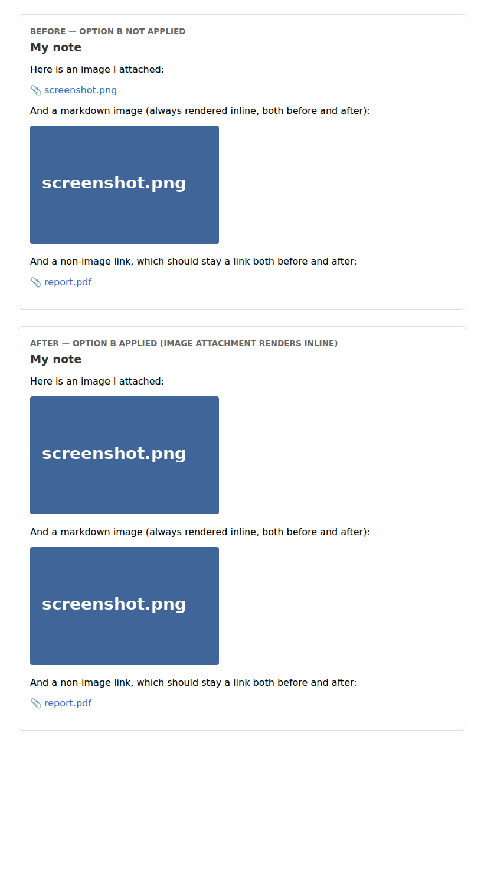
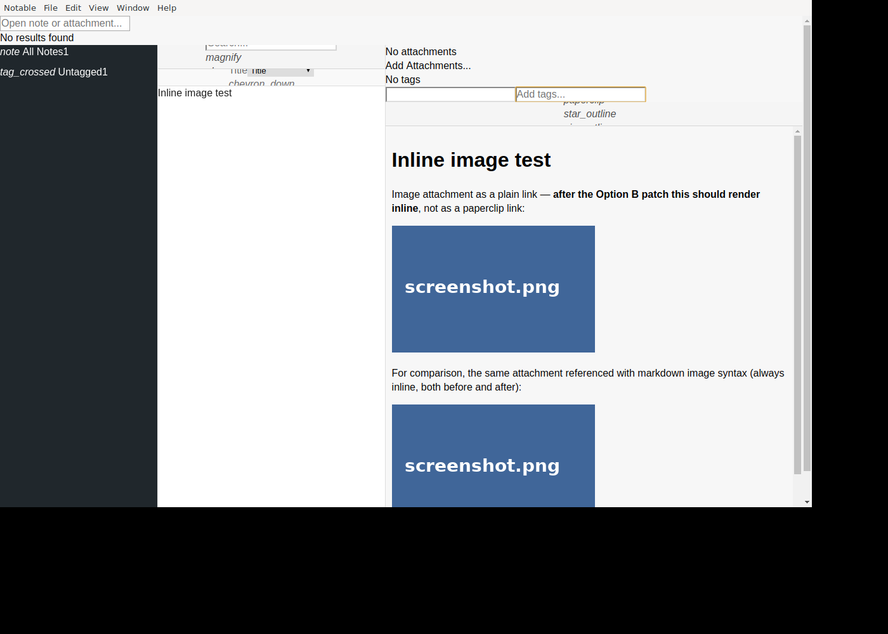

# Attachment preview patch (Notable v1.5.1)

Render image attachments inline in the markdown preview, even when written as
plain links — and emit the markdown image syntax automatically when an image
is added via the **Attach** popover.

## What changes

Two source edits against [`notable/notable@v1.5.1`](https://github.com/notable/notable/tree/v1.5.1):

| File | Lines | Effect |
|---|---|---|
| `src/renderer/utils/markdown.ts` | +13 | New Showdown output rule. Any `<a href="@attachment/foo.png">…</a>` whose URL has an image extension (png, jpg, jpeg, gif, webp, svg, avif, bmp, ico) is rewritten to ``. Non-image attachments are untouched. |
| `src/renderer/containers/main/note.ts` | +15 | When attachments are added via `addAttachments()`, also insert markdown for each into the editor (`` for images, `[name](@attachment/name)` for everything else). Skipped if the editor isn't active. |

The full diff is in [`0001-attachment-preview.patch`](./0001-attachment-preview.patch).

## Before / after

The same source markdown rendered with the unmodified extension and the patched one:

```md
[screenshot.png](@attachment/screenshot.png)

[report.pdf](@attachment/report.pdf)
```

| Token | Before | After |
|---|---|---|
| `[screenshot.png](@attachment/screenshot.png)` | paperclip link | **inline ``** |
| `` | inline `` | inline `` (unchanged) |
| `[report.pdf](@attachment/report.pdf)` | paperclip link | paperclip link (unchanged) |

The HTML diff:

```diff
- <a href="…/screenshot.png" class="attachment" data-filename="screenshot.png">…screenshot.png</a>
+ 
```



The patch also verified in a running Notable v1.5.1 Electron build (the
unstyled chrome is the result of a stubbed `notable.min.css` used to bypass
the broken-on-modern-toolchains svelto build — not from this patch):



---

## Local testing

You have two paths, depending on how much you want to rebuild.

### Option 1 — Headless verification (recommended, takes ~10 seconds)

This runs the **exact patched Showdown extension code** through standalone
`showdown` against a fixture note, then writes an HTML page you can open in any
browser. No Electron build required.

```bash
cd patches/attachment-preview/headless-test
npm init -y >/dev/null && npm install showdown
node render.js                            # prints HTML to stdout
# also writes ./preview.html — open it in a browser
```

You should see two stacked panels — "Before" (paperclip link for the image
attachment) and "After" (inline ``).

### Option 2 — Full Notable v1.5.1 build with the patch applied

#### 2a — macOS one-liner (recommended)

```sh
bash patches/attachment-preview/setup-local.sh
```

That script installs Node 16 via nvm, clones [`notable/notable@v1.5.1`](https://github.com/notable/notable/tree/v1.5.1) into `~/notable-app`, applies the feature patch, applies every environment workaround documented below, builds prerequisites, and prints the launch command. Pass a directory as the first argument to override the install location.

Tested on Apple Silicon — Electron 5 has no native arm64 build, so macOS will prompt to install Rosetta 2 on first launch. Accept.

#### 2b — Step by step

You'll need Node 12-16 (I used Node 16.20.2 via nvm).

```bash
# 1. Clone v1.5.1
git clone https://github.com/notable/notable.git
cd notable
git checkout v1.5.1

# 2. Apply the patch
git apply /path/to/patches/attachment-preview/0001-attachment-preview.patch

# 3. Install deps. v1.5.1's package.json references three GitHub forks
#    that have since been deleted, so you'll need these workarounds:
#
#    a) Replace the deleted electron-webpack fork with the published one:
#       In package.json devDependencies, change
#         "electron-webpack": "git://github.com/fabiospampinato/electron-webpack.git#package-electron-webpack"
#       to
#         "electron-webpack": "^2.8.2"
#
#    b) Add an `overrides` block so npm rewrites two more deleted forks:
#       "overrides": {
#         "caporal": "^1.4.0",
#         "gulp-if": "^3.0.0"
#       }
#
#    c) Make ssh+git URLs fall back to https (some transitives still try git://):
git config --global --add url."https://github.com/".insteadOf "ssh://git@github.com/"
git config --global --add url."https://github.com/".insteadOf "git://github.com/"

npm install --legacy-peer-deps

# 4. Build the prerequisites
npm run svelto:dev          # CSS  — note: may fail because pacco's caporal
                            #        usage doesn't match the published caporal@1.x
                            #        API. If it fails you can stub
                            #        src/renderer/template/dist/css/notable.min.css
                            #        with an empty file and continue; the UI will
                            #        be unstyled but the patch under test still works.
npm run monaco              # Monaco editor bundle
npm run iconfont
npm run tutorial

# 5. Launch
npm run dev                 # terminal 1
npm run svelto:dev:watch    # terminal 2 (skip if svelto:dev didn't run)
```

Once Notable opens, point its data directory at any folder containing
`notes/` and `attachments/` subdirs (or copy [`headless-test/fixtures`](./headless-test/fixtures)
into one). Create a note containing
`[screenshot.png](@attachment/screenshot.png)` — with the patch applied, the
preview pane renders it as an inline image.

### Caveats on the full build

If you're on a modern Node (≥ 17), the v1.5.1 toolchain will throw various
errors. Specific things I had to work around:

- `electron-updater@4.6.5` (auto-installed from `^4.0.6`) requires `fs/promises`,
  which Electron 5's bundled Node 12 doesn't ship. Either pin
  `"electron-updater": "4.0.6"` exactly, or stub it locally.
- The renderer's `import 'asciimath2tex/asciimath2tex.js'` no longer resolves
  because the published `asciimath2tex` package moved its source under `dist/`.
  Change it to `import 'asciimath2tex'`.
- Linux runtime: install `libxss1`, `libgbm1`, `libgtk-3-0`, `libnss3` for
  Electron 5.

These are environment fixes, not part of the feature, so they're not in the
patch itself.
